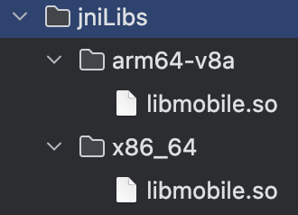

# android

## 安装工具

```
rustup target add aarch64-linux-android x86_64-linux-android
cargo install cargo-apk cargo-ndk
```

## 安装ndk

下载ndk到某个目录
```
nano ~/.zshrc
export ANDROID_NDK_HOME=/Users/root1/Library/Android/sdk/ndk/28.0.13004108`（ndk所在目录）
source ~/.zshrc
echo $ANDROID_NDK_HOME
```


## rust函数编写

调用函数的编写要符合jni标准
eg.
```
// use jni::objects::{JObject, JString};
// use jni::sys::jstring;
// use jni::JNIEnv;

// #[no_mangle]
// pub extern "C" fn Java_com_example_rustlibrary_LyTest_lyFunction(
//     env: JNIEnv<'_>,
//     _: JObject<'_>,
// ) -> jstring {
//     let output = "Hello from Rust";
    
//     // 创建 Java 字符串
//     match env.new_string(output) {
//         Ok(java_str) => {
//             // 正确转换 JString 到 jstring
//             java_str.into_raw()
//         }
//         Err(_) => {
//             // 返回空指针给 Java
//             std::ptr::null_mut()
//         }
//     }
// }
```


## 编译so

### arm
`cargo ndk -t aarch64-linux-android -o /Users/root1/AndroidStudioProjects/RustDemo/rustlibrary/src/main/jniLibs build`
### x86
`cargo ndk -t x86_64-linux-android -o /Users/root1/AndroidStudioProjects/RustDemo/rustlibrary/src/main/jniLibs build`

## 编译aar

在as新建一个module（比如叫rustlibrary）
把so文件放在rustlibrary/src/main/jniLibs/{架构类型}



在build.gradle添加
```

android {
    sourceSets{
        main{
            jniLibs.srcDirs=['src/main/jniLibs']
        }
    }
}
```

在rustlibrary/src/main/java/com/example/rustlibrary定义一个类来调用rust函数
eg.
```
package com.example.rustlibrary;
public class LyTest {
    // 加载 Rust 库
    static {
        System.loadLibrary("mobile");
    }
    public native void evmTest(long value);
    public native String lyFunction();
}
```
在as中make module，之后得到aar文件在rustlibrary/build/outputs/aar

# ios

## 安装工具
```
cargo install cargo-lipo
cargo install cbindgen
```

## rust函数编写

eg.
```
#[no_mangle]
pub unsafe extern "C" fn evm_test(){

}
```

## 编译静态库
可以根据实际情况来增加或者减少目标平台
`cargo lipo --all-features --release --targets x86_64-apple-ios aarch64-apple-ios`
得到.a文件在target/universal/release

生成头文件
`cbindgen /Users/root1/Desktop/N42-rs/crates/n42/mobile/src/lib.rs -l c --output /Users/root1/Desktop/N42-rs/crates/n42/mobile/src/librust.h`


另一个头文件Demo-Bridging-Header.h
```
#ifndef Demo_Bridging_Header_h
#define Demo_Bridging_Header_h

#import "librust.h"

#endif
```
